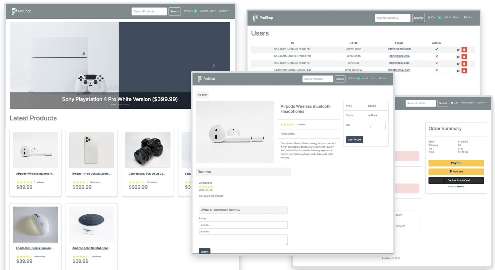

# Ajwani store eCommerce Platform (v2)

> eCommerce platform built with the MERN stack & Redux.



This project is part of my [MERN Stack From Scratch | eCommerce Platform](https://www.traversymedia.com/mern-stack-from-scratch) course. It is a full-featured shopping cart with PayPal & credit/debit payments. See it in action at https://www.proshopdemo.dev

This is version 2.0 of the app, which uses Redux Toolkit. The first version can be found [here](https://proshopdemo.dev)

<!-- toc -->

- [Features](#features)
- [Usage](#usage)
  - [Env Variables](#env-variables)
  - [Install Dependencies (frontend & backend)](#install-dependencies-frontend--backend)
  - [Run](#run)
- [Build & Deploy](#build--deploy)
  - [Seed Database](#seed-database)

* [Bug Fixes, corrections and code FAQ](#bug-fixes-corrections-and-code-faq)
  - [BUG: Warnings on ProfileScreen](#bug-warnings-on-profilescreen)
  - [BUG: Changing an uncontrolled input to be controlled](#bug-changing-an-uncontrolled-input-to-be-controlled)
  - [BUG: All file types are allowed when updating product images](#bug-all-file-types-are-allowed-when-updating-product-images)
  - [BUG: Throwing error from productControllers will not give a custom error response](#bug-throwing-error-from-productcontrollers-will-not-give-a-custom-error-response)
    - [Original code](#original-code)
  - [BUG: Bad responses not handled in the frontend](#bug-bad-responses-not-handled-in-the-frontend)
    - [Example from PlaceOrderScreen.jsx](#example-from-placeorderscreenjsx)
  - [BUG: After switching users, our new user gets the previous users cart](#bug-after-switching-users-our-new-user-gets-the-previous-users-cart)
  - [FAQ: How do I use Vite instead of CRA?](#faq-how-do-i-use-vite-instead-of-cra)
    - [Setting up the proxy](#setting-up-the-proxy)
    - [Setting up linting](#setting-up-linting)
    - [Vite outputs the build to /dist](#vite-outputs-the-build-to-dist)
    - [Vite has a different script to run the dev server](#vite-has-a-different-script-to-run-the-dev-server)
    - [A final note:](#a-final-note)
  * [License](#license)

<!-- tocstop -->

## Features

- Full featured shopping cart
- Product reviews and ratings
- Top products carousel
- Product pagination
- Product search feature
- User profile with orders
- Admin product management
- Admin user management
- Admin Order details page
- Mark orders as delivered option
- Checkout process (shipping, payment method, etc)
- PayPal / credit card integration
- Database seeder (products & users)

## Usage

- Create a MongoDB database and obtain your `MongoDB URI` - [MongoDB Atlas](https://www.mongodb.com/cloud/atlas/register)
- Create a PayPal account and obtain your `Client ID` - [PayPal Developer](https://developer.paypal.com/)

### Env Variables

Rename the `.env.example` file to `.env` and add the following

```
NODE_ENV = development
PORT = 5000
MONGO_URI = your mongodb uri
JWT_SECRET = 'abc123'
PAYPAL_CLIENT_ID = your paypal client id
PAGINATION_LIMIT = 8
```

Change the JWT_SECRET and PAGINATION_LIMIT to what you want

### Install Dependencies (frontend & backend)

```
npm install
cd frontend
npm install
```

### Run

```

# Run frontend (:3000) & backend (:5000)
npm run dev

# Run backend only
npm run server
```

## Build & Deploy

```
# Create frontend prod build
cd frontend
npm run build
```

### Seed Database

You can use the following commands to seed the database with some sample users and products as well as destroy all data

```
# Import data
npm run data:import

# Destroy data
npm run data:destroy
```

```
Sample User Logins

admin@email.com (Admin)
123456

john@email.com (Customer)
123456

jane@email.com (Customer)
123456
```

---

# Bug Fixes, corrections and code FAQ

The code here in the main branch has been updated since the course was published to fix bugs found by students of the course and answer common questions, if you are looking to compare your code to that from the course lessons then
please refer to the [originalcoursecode](https://github.com/bradtraversy/proshop-v2/tree/originalCourseCode) branch of this repository.

There are detailed notes in the comments that will hopefully help you understand
and adopt the changes and corrections.
An easy way of seeing all the changes and fixes is to use a note highlighter
extension such as [This one for VSCode](https://marketplace.visualstudio.com/items?itemName=wayou.vscode-todo-highlight) or [this one for Vim](https://github.com/folke/todo-comments.nvim) Where by you can easily list all the **NOTE:** and **FIX:** tags in the comments.

### BUG: Warnings on ProfileScreen

We see the following warning in the browser console..

`<tD> cannot appear as a child of <tr>.`

and

`warning: Received 'true' for a non-boolean attribute table.`

> Code changes can be seen in [ProfileScreen.jsx](./frontend/src/screens/ProfileScreen.jsx)

### BUG: Changing an uncontrolled input to be controlled

In our SearchBox input, it's possible that our `urlKeyword` is **undefined**, in
which case our initial state will be **undefined** and we will have an
uncontrolled input initially i.e. not bound to state.
In the case of `urlKeyword` being **undefined** we can set state to an empty
string.

> Code changes can be seen in [SearchBox.jsx](./frontend/src/components/SearchBox.jsx)

### BUG: All file types are allowed when updating product images

When updating and uploading product images as an Admin user, all file types are allowed. We only want to upload image files. This is fixed by using a fileFilter function and sending back an appropriate error when the wrong file type is uploaded.

You may see that our `checkFileType` function is declared but never actually
used, this change fixes that. The function has been renamed to `fileFilter` and
passed to the instance of [ multer ](https://github.com/expressjs/multer#filefilter)

> Code changes can be seen in [uploadRoutes.js](./backend/routes/uploadRoutes.js)

### BUG: Throwing error from productControllers will not give a custom error response

In section **3 - Custom Error Middleware** we throw an error from our
`getProductById` controller function, with a _custom_ message.
However if we have a invalid **ObjectId** as `req.params.id` and use that to
query our products in the database, Mongoose will throw an error before we
reach the line of code where we throw our own error.

#### Original code

```js
const getProductById = asyncHandler(async (req, res) => {
  const product = await Product.findById(req.params.id);
  if (product) {
    return res.json(product);
  }
  // NOTE: the following will never run if we have an invalid ObjectId
  res.status(404);
  throw new Error('Resource not found');
});
```

Instead what we can do is if we do want to check for an invalid ObjectId is use
a built in method from Mongoose - [isValidObjectId](<https://mongoosejs.com/docs/api/mongoose.html#Mongoose.prototype.isValidObjectId()>)
There are a number of places in the project where we may want to check we are
getting a valid ObjectId, so we can extract this logic to it's own middleware
and drop it in to any route handler that needs it.  
This also removes the need to check for a cast error in our errorMiddleware and
is a little more explicit in checking fo such an error.

> Changes can be seen in [errorMiddleware.js](./backend/middleware/errorMiddleware.js), [productRoutes.js](./backend/routes/productRoutes.js), [productController.js]('./backend/controllers/productController.js') and [checkObjectId.js](./backend/middleware/checkObjectId.js)

### BUG: Bad responses not handled in the frontend

There are a few cases in our frontend where if we get a bad response from our
API then we try and render the error object.
This you cannot do in React - if you are seeing an error along the lines of
**Objects are not valid as a React child** and the app breaks for you, then this
is likely the fix you need.

#### Example from PlaceOrderScreen.jsx

```jsx
<ListGroup.Item>
  {error && <Message variant='danger'>{error}</Message>}
</ListGroup.Item>
```

In the above code we check for a error that we get from our [useMutation](https://redux-toolkit.js.org/rtk-query/usage/mutations)
hook. This will be an object though which we cannot render in React, so here we
need the message we sent back from our API server...

```jsx
<ListGroup.Item>
  {error && <Message variant='danger'>{error.data.message}</Message>}
</ListGroup.Item>
```

The same is true for [handling errors from our RTK queries.](https://redux-toolkit.js.org/rtk-query/usage/error-handling)

> Changes can be seen in:-
>
> - [PlaceOrderScreen.jsx](./frontend/src/screens/PlaceOrderScreen.jsx)
> - [OrderScreen.jsx](./frontend/src/screens/OrderScreen.jsx)
> - [ProductEditScreen.jsx](./frontend/src/screens/admin/ProductEditScreen.jsx)
> - [ProductListScreen.jsx](./frontend/src/screens/admin/ProductListScreen.jsx)

BUG
no proper web based notification
no proper mobile setup
ignore fastapi


